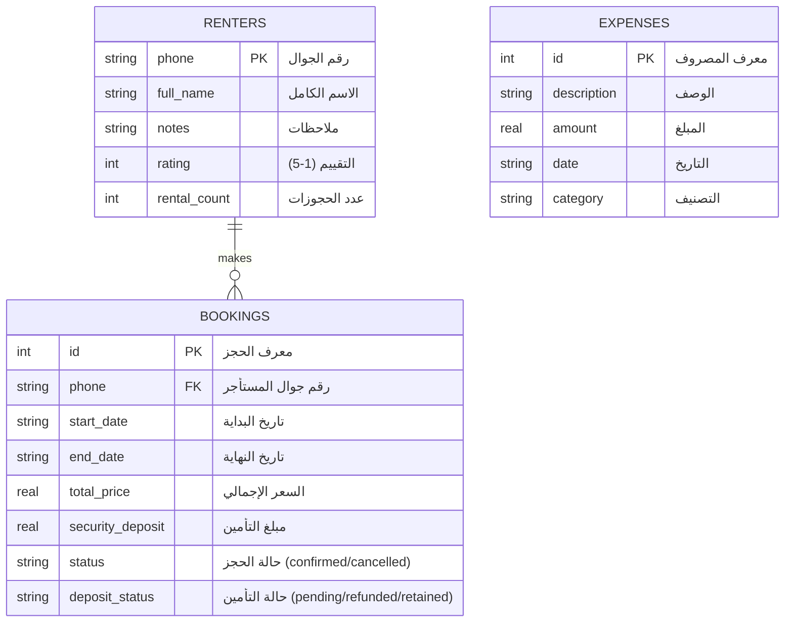

# 🏡 نظام إدارة حجوزات الاستراحات (Resthouse Management System)

[](https://flutter.dev)
[](https://dart.dev)
[](https://www.sqlite.org/)
[]()
[]()

تطبيق متكامل وسهل الاستخدام لإدارة الاستراحات وتفادي أخطاء الحجوزات المزدوجة، مخصص للعمل بكفاءة عالية على أجهزة الحاسوب (سطح المكتب) والأجهزة الذكية (الهواتف والألواح)، مع دعم كامل للغة العربية والتقويمين الهجري والميلادي.

---

## 📋 جدول المحتويات
1. [نظرة عامة](#-نظرة-عامة)
2. [المميزات الرئيسية](#-المميزات-الرئيسية)
3. [تقنيات المشروع (Tech Stack)](#-تقنيات-المشروع-tech-stack)
4. [هيكلية البيانات (Database Schema)](#-هيكلية-البيانات-database-schema)
5. [هيكل المشروع (Directory Structure)](#-هيكل-المشروع-directory-structure)
6. [متطلبات التشغيل](#-متطلبات-التشغيل)
7. [خطوات التثبيت والتشغيل](#-خطوات-التثبيت-والتشغيل)
8. [النسخ الاحتياطي واستعادة البيانات](#-النسخ-الاحتياطي-واستعادة-البيانات)
9. [الترخيص](#-الترخيص)

---

## 🌟 نظرة عامة

يقدم مشروع **نظام إدارة حجوزات الاستراحات (`resthouse_app`)** حلًا شاملاً ومستقلاً (Offline-First) لملاك ومُديري الاستراحات والشاليهات. يتيح التطبيق متابعة الحجوزات، المستأجرين، المبالغ المالية، التأمينات المستردة، والمصاريف التشغيلية من خلال لوحة تحكم تفاعلية وتقارير بيانية دقيقة دون الحاجة لاتصال دائم بالإنترنت.

---

## ✨ المميزات الرئيسية

### 1. 📊 لوحة التحكم الإحصائية (Dashboard)
- عرض الإحصائيات الحالية (إجمالي الحجوزات، الإيرادات، المصروفات، صافي الأرباح).
- رسوم بيانية تفاعلية تدعم تحليلات الأداء المالي والحجوزات باستخدام مكتبة (`fl_chart`).
- التنبيه بالحجوزات المستحقة والمستأجرين وإدارة حالات التأمينات المالية.

### 2. 📅 إدارة الحجوزات والتقويم (Bookings & Calendar)
- عرض تقويم تفاعلي شامل يدمج التاريخ **الهجري والميلادي**.
- آلية ذكية لمنع تعارض الحجوزات (Overlap Conflict Detection).
- متابعة حالة الحجز (مؤكد، ملغى) وحالة مبلغ التأمين (قيد الانتظار، مسترد، مستقطع).
- إضافة وتعديل الحجوزات بسهولة وتحديث سجل المستأجر تلقائيًا.

### 3. 👥 إدارة المستأجرين (Renters Management)
- تسجيل بيانات المستأجرين (الاسم، رقم الهاتف، التقييم، الملاحظات).
- السجل التاريخي لحجوزات كل مستأجر وعدد المرات التي استأجر فيها.
- ربط تلقائي ومزامنة بيانات الهاتف مع الحجوزات.

### 4. 💰 إدارة المالية والمصروفات (Finance & Expenses)
- تتبع الإيرادات والمصروفات وتوزيع المصاريف حسب التصنيف (تشغيلية، صيانة، فواتير، إلخ).
- إحصائيات مالية حسابية دقيقة لحساب الأرباح والخسائر.
- إمكانية إضافة مصروفات جديدة واختيار تصنيفات مرنة.

### 5. ⚙️ النسخ الاحتياطي وتصميم التجاوب (Backup & Responsiveness)
- تصدير واسترجاع بيانات النظام كملف JSON لضمان حفظ البيانات وسهولة النقل.
- زر إدخال بيانات تجريبية (Seed Data) للاختبار والتهيئة السريعة.
- دعم كامل للتجاوب (Responsive Layout): القائمة الجانبية (Sidebar) للشاشات الكبيرة (Desktop/Tablet) وشريط التنقل السفلي (Bottom Navigation) للهواتف الذكية.

---

## 🛠 تقنيات المشروع (Tech Stack)

| التقنية / المكتبة | الغرض / الاستخدام |
| :--- | :--- |
| **Flutter 3.x / Dart 3.9** | إطار العمل الرئيسي لتطوير الواجهات المتعددة المنصات |
| **`sqflite` & `sqflite_common_ffi`** | قاعدة بيانات محليّة سريعة تعمل على الهواتف وسطح المكتب (Windows/Linux/macOS) |
| **`hijri`** | تحويل وتحديد المواعيد والتواريخ الهجرية بدقة |
| **`table_calendar`** | عرض التقويم المخصص وتحديد الأيام والحجوزات |
| **`fl_chart`** | رسم المخططات والرسوم البيانية المالية والتحليلية |
| **`file_picker` & `path_provider`** | إدارة وتحديد الملفات وقراءة مسارات الحفظ للنسخ الاحتياطي |
| **`flutter_localizations`** | دعم اللغة العربية والاتجاه من اليمين إلى اليسار (RTL) |

---

## 🗄 هيكلية البيانات (Database Schema)

يعتمد التطبيق على قاعدة بيانات **SQLite** محلية تحتوي على ثلاثة جداول رئيسية:



---

## 📁 هيكل المشروع (Directory Structure)

```text
resthouse_app/
├── android/                   # إعدادات منصة أندرويد
├── ios/                       # إعدادات منصة iOS
├── windows/                   # إعدادات منصة ويندوز
├── assets/                    # الأصول والملفات المساعدة (الأيقونات)
│   └── icon/
│       └── logo.png
├── lib/                       # كود Dart الرئيسي
│   ├── main.dart              # نقطة بداية التطبيق وإعدادات الثيم واللغة
│   ├── database_helper.dart   # إدارة قاعدة بيانات SQLite وعمليات CRUD والنسخ
│   ├── pages/                 # الشاشات والواجهات الرئيسية
│   │   ├── main_shell.dart            # الهيكل الرئيسي والتنقل (Sidebar / BottomBar)
│   │   ├── ultimate_dashboard_page.dart # لوحة التحكم العامة والإحصائيات
│   │   ├── booking_manager_page.dart  # شاشة الحجوزات والتقويم والمستأجرين
│   │   ├── finance_page.dart          # شاشة الحسابات والمصروفات والرسوم البيانية
│   │   └── settings_page.dart         # شاشة الإعدادات والنسخ الاحتياطي
│   └── utils/                 # الأدوات المساعدة والتجاوب
│       └── responsive.dart    # امتدادات ضبط أحجام الخطوط والشاشات
├── pubspec.yaml               # ملف الحزم والاعتمادات
└── README.md                  # توثيق المشروع
```

---

## 💻 متطلبات التشغيل

قبل البدء، تأكد من تثبيت الأدوات التالية على جهازك:
- **Flutter SDK**: الإصدار `3.19.0` أو أحدث.
- **Dart SDK**: الإصدار `3.9.0` أو أحدث.
- **C++ Build Tools** (في حال التشغيل على Windows).
- **Android Studio / Xcode** (في حال التشغيل على الهواتف).

---

## 🚀 خطوات التثبيت والتشغيل

### 1. الاستنساخ (Clone)
قم باستنساخ المستودع إلى جهازك المحلي:
```bash
git clone https://github.com/3thelast-glitch/resthouse_app.git
cd resthouse_app
```

### 2. تحميل الحزم (Fetch Dependencies)
قم بتشغيل الأمر التالي لتنزيل جميع الحزم والاعتمادات:
```bash
flutter pub get
```

### 3. التشغيل (Run)

#### التشغيل على سطح المكتب (Windows):
```bash
flutter run -d windows
```

#### التشغيل على المحاكي أو جهاز أندرويد:
```bash
flutter run -d android
```

#### تشغيل النسخة المستقرة (Release Build):
```bash
# ويندوز
flutter build windows

# أندرويد APK
flutter build apk --release
```

---

## 💾 النسخ الاحتياطي واستعادة البيانات

يوفر التطبيق خيار حماية البيانات ونقلها بسهولة عبر صفحة **الإعدادات**:
1. **تصدير النسخة الاحتياطية**: يتم توليد ملف `JSON` يحتوي على جميع الحجوزات، المستأجرين، والمصروفات.
2. **استعادة النسخة الاحتياطية**: اختيار ملف `JSON` واسترجاع البيانات بضغطة زر.
3. **تصفير قاعدة البيانات**: خيار لإعادة تهيئة النظام أو إضافة بيانات تجريبية سريعة.

---

## 📄 الترخيص (License)

هذا المشروع مرخص بموجب رخصة **MIT**. يمكنك استخدامه وتعديله وتطويره بحرية.

```text
حقوق الطبع والنشر © 2026 - نظام إدارة حجوزات الاستراحات.
```
